# マルチサーチエンジンアプリケーション - 論理アーキテクチャ

## 概要

マルチサーチエンジンアプリケーション（v1.3.1）は、6つの検索エンジン（Google、Bing、Yahoo Japan、DuckDuckGo、YouTube、Baidu）に対して同時に検索クエリを実行し、結果を統合表示するWebアプリケーションです。ダークモード対応、多言語サポート、検索エンジン直接リンク機能を備えています。本文書では、アプリケーションの論理アーキテクチャを詳細に説明します。

## スクリーンショット

### ライトモード

### ダークモード

## 主要機能
- 🔍 6つの検索エンジンでの同時検索
- 🌐 4言語対応（日本語、英語、中国語、韓国語）
- 🌙 ダークモード・ライトモード切り替え
- 🔗 検索エンジン直接リンク
- 📱 レスポンシブデザイン
- ⚡ キャッシュ機能
- ⚠️ 包括的エラーハンドリング
- 📸 視覚的なユーザーガイド

## システム全体アーキテクチャ

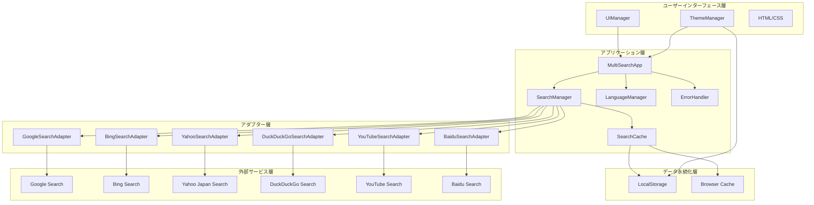

## レイヤー別詳細アーキテクチャ

### 1. ユーザーインターフェース層

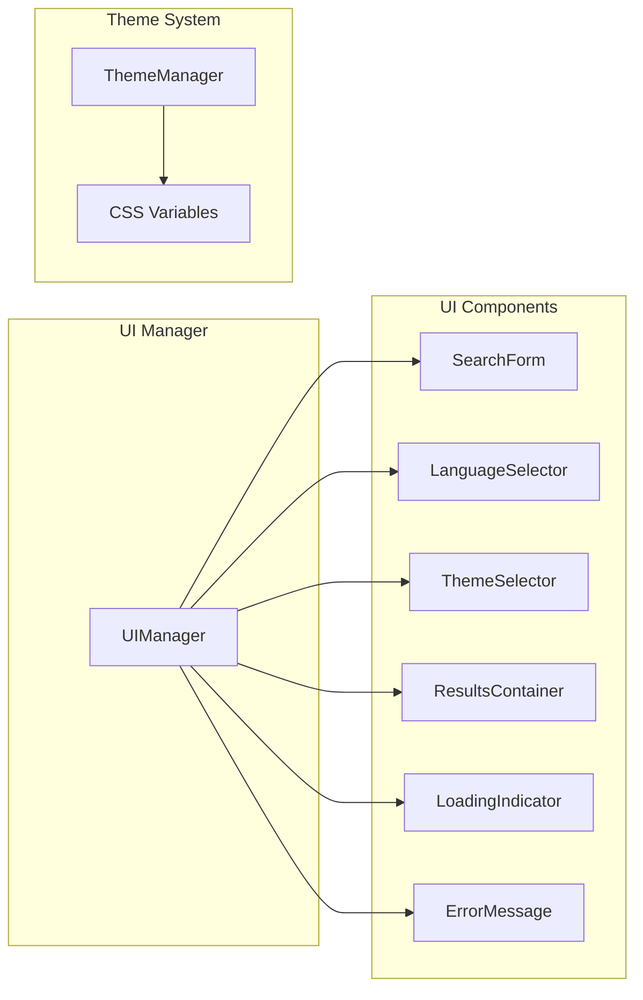

**責務:**
- ユーザーインタラクションの処理
- 検索結果の表示
- テーマ（ライト/ダーク）の管理
- レスポンシブデザインの提供

### 2. アプリケーション層

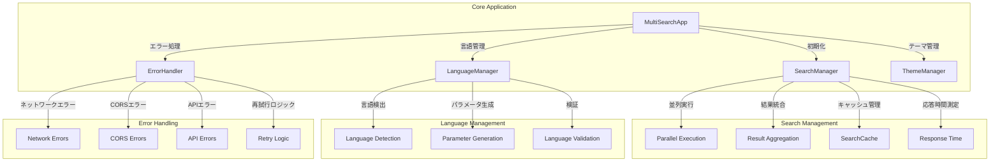

**責務:**
- アプリケーションのライフサイクル管理
- 検索処理の統合制御
- 言語設定の管理
- エラーハンドリングの統合
- キャッシュ戦略の実装

### 3. アダプター層

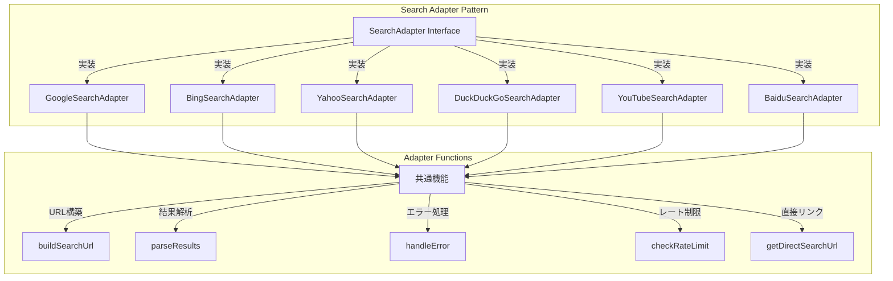

**責務:**
- 各検索エンジンのAPI/スクレイピング処理
- 検索結果の正規化
- エンジン固有のエラーハンドリング
- レート制限の管理
- 直接検索リンクの生成

### 4. データフロー図

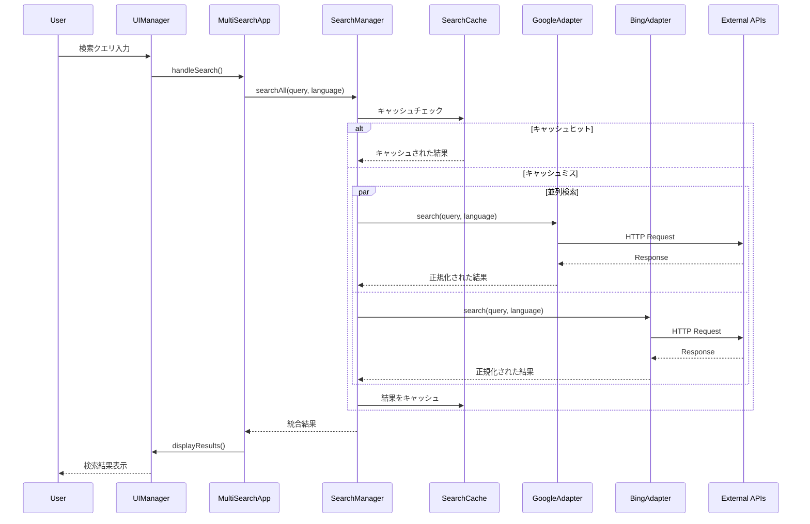

## コンポーネント間の依存関係

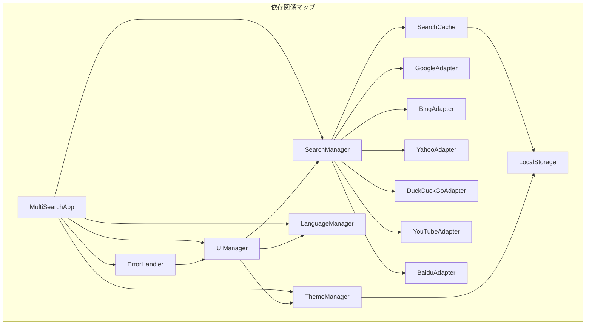

## 設計パターンの適用

### 1. アダプターパターン
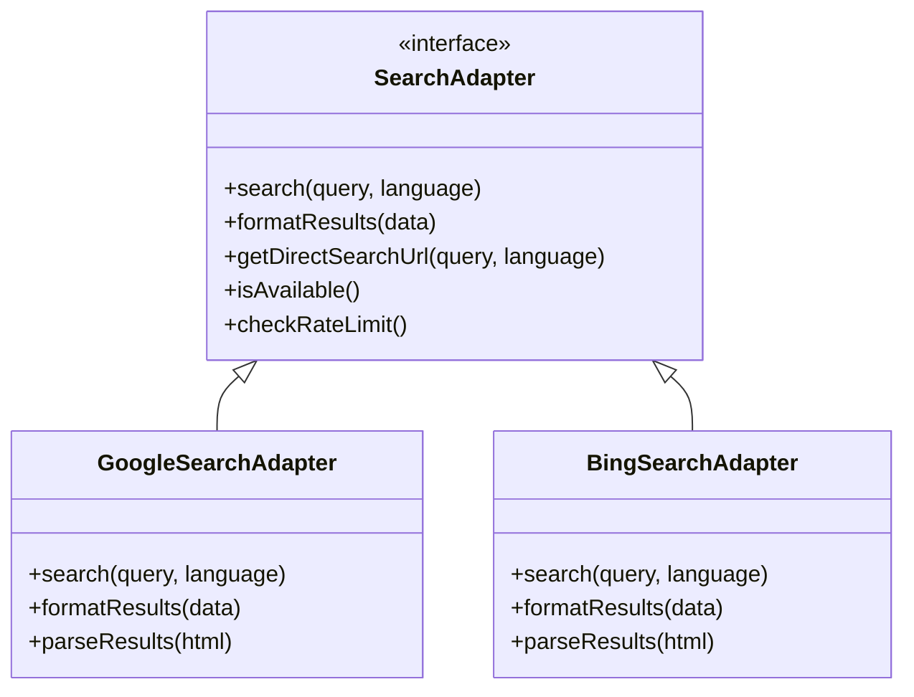

### 2. ファサードパターン
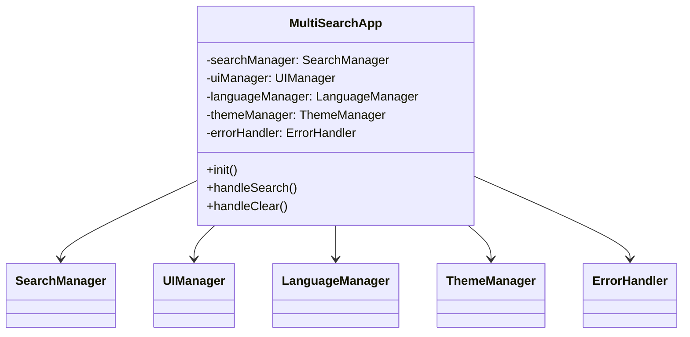

### 3. オブザーバーパターン
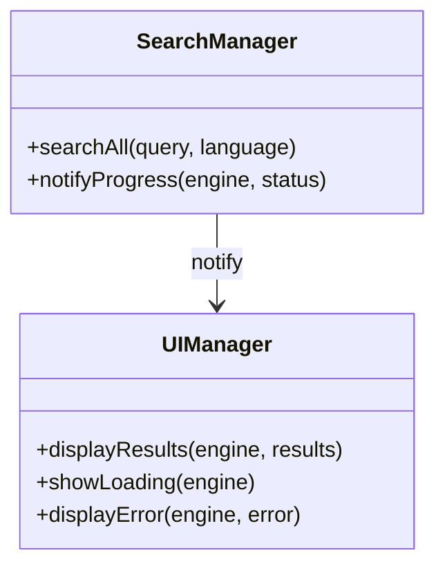

## セキュリティアーキテクチャ

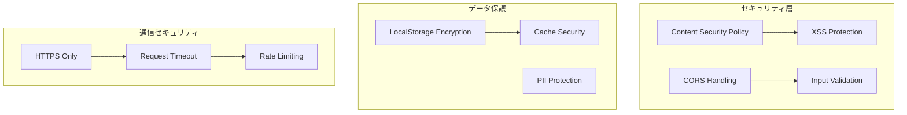

## パフォーマンスアーキテクチャ

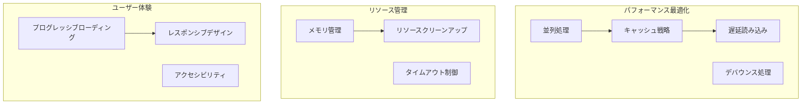

## 拡張性の考慮

### 新しい検索エンジンの追加
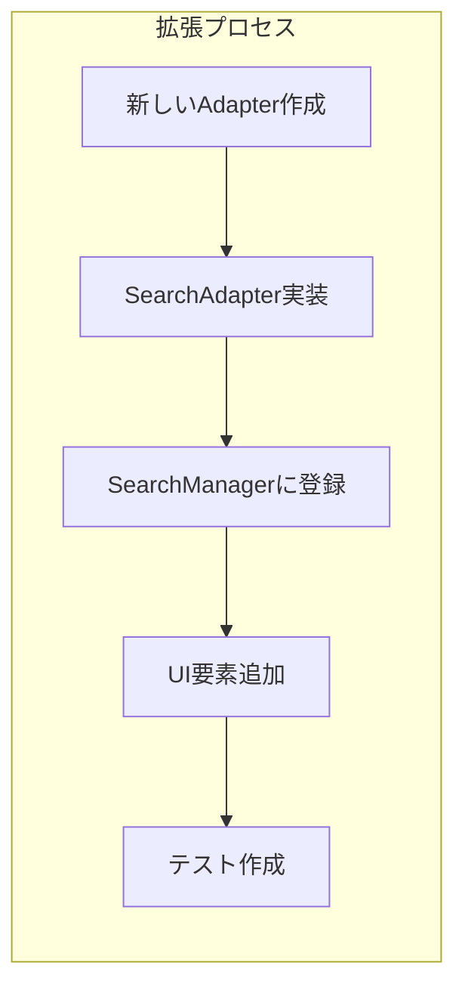

### 新機能の追加
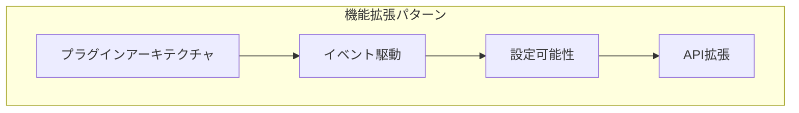

## 運用・監視アーキテクチャ

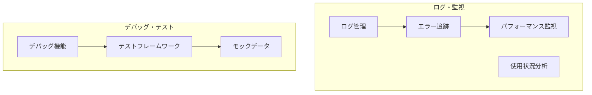

## バージョン履歴とアーキテクチャの進化

### v1.3.1 - ドキュメント整備とプロジェクト完成
- **包括的ドキュメント更新**: 全ドキュメントファイルの最新情報への更新
- **スクリーンショット追加**: ライトモードとダークモードの視覚的ガイド
- **プロジェクト完成度向上**: 全機能実装完了とドキュメント統一

### v1.3.0 - テーマシステムの追加
- **ThemeManager**の導入
- CSS変数によるテーマシステム
- システムテーマ検出機能
- ローカルストレージによる設定永続化

### v1.2.0 - 直接リンク機能
- 各SearchAdapterに`getDirectSearchUrl()`メソッド追加
- UIManagerにリンク生成・更新機能追加
- 動的リンク管理システム

### v1.1.0 - Baiduサポート
- BaiduSearchAdapterの追加
- 中国語特有の処理機能
- 6つの検索エンジン対応

### v1.0.0 - 基本アーキテクチャ
- レイヤードアーキテクチャの確立
- アダプターパターンの実装
- 並列検索システム

## 技術的負債と改善点

### 現在の制約
1. **CORS制限**: 多くの検索エンジンで直接アクセス不可
2. **スクレイピング依存**: APIが利用できない場合の代替手段
3. **レート制限**: 各検索エンジンの制限への対応

### 将来の改善計画
1. **プロキシサーバー**: CORS制限の根本的解決
2. **PWA対応**: オフライン機能とインストール可能性
3. **検索履歴**: ユーザーの検索パターン分析
4. **AI統合**: 検索結果の要約と分析

## まとめ

このマルチサーチエンジンアプリケーション（v1.3.1）は、以下の設計原則に基づいて構築されています：

1. **🔧 関心の分離**: 各コンポーネントが明確な責務を持つ
2. **📈 拡張性**: 新しい検索エンジンや機能を容易に追加可能
3. **🛠️ 保守性**: モジュラー設計により保守が容易
4. **⚡ パフォーマンス**: 並列処理とキャッシュによる高速化
5. **👥 ユーザビリティ**: レスポンシブデザインとアクセシビリティ
6. **🛡️ 堅牢性**: 包括的なエラーハンドリング
7. **🔒 セキュリティ**: XSS対策とCSP実装
8. **🎨 テーマ対応**: ダークモード・ライトモードの動的切り替え
9. **🌐 国際化**: 多言語対応と文化的配慮

この論理アーキテクチャにより、スケーラブルで保守性が高く、ユーザーフレンドリーなマルチサーチエンジンアプリケーションが実現されています。

## 関連ドキュメント

- **[README.md](README.md)**: プロジェクト概要と使用方法
- **[CHANGELOG.md](CHANGELOG.md)**: 詳細な変更履歴
- **[requirements.md](requirements.md)**: 要件定義書
- **[design.md](design.md)**: 設計書
- **[tasks.md](tasks.md)**: 実装計画